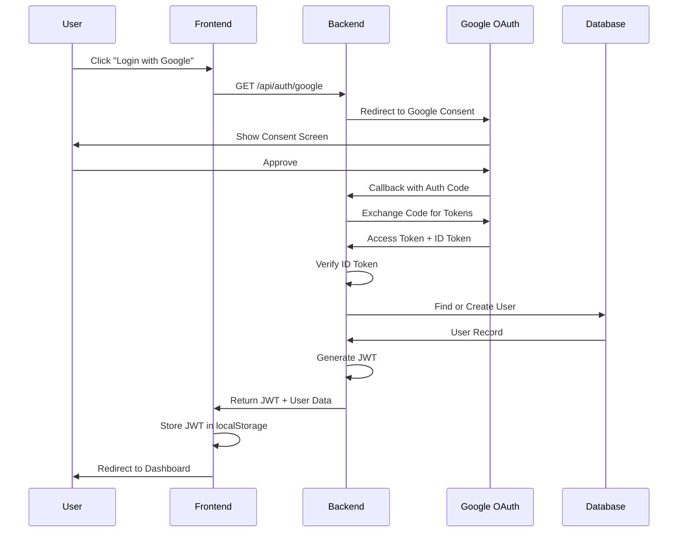
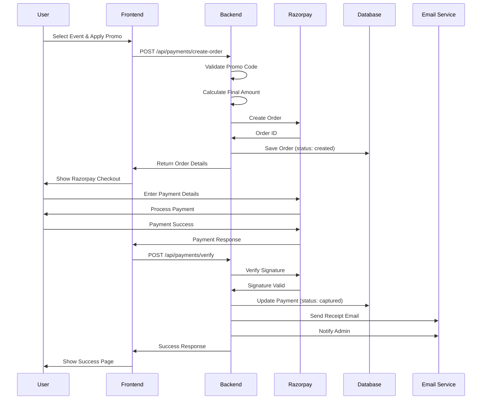

# Cerebrexia - Technical Architecture Document

## 🏛️ System Architecture Overview

### High-Level Architecture

```
┌─────────────────────────────────────────────────────────────────┐
│                         CLIENT LAYER                             │
├─────────────────────────────────────────────────────────────────┤
│  Web Browser (React SPA)  │  Mobile Browser  │  Admin Portal    │
└─────────────┬───────────────────────┬─────────────────┬─────────┘
              │                       │                 │
              │        HTTPS          │                 │
              │                       │                 │
┌─────────────▼───────────────────────▼─────────────────▼─────────┐
│                    LOAD BALANCER (Nginx)                         │
│                    - SSL Termination                             │
│                    - Rate Limiting                               │
│                    - Request Routing                             │
└─────────────┬───────────────────────┬─────────────────┬─────────┘
              │                       │                 │
┌─────────────▼─────────┐  ┌──────────▼──────────┐  ┌──▼─────────┐
│   App Server 1        │  │   App Server 2      │  │  App N     │
│   (Node.js/Express)   │  │   (Node.js/Express) │  │            │
│   - REST API          │  │   - REST API        │  │            │
│   - Business Logic    │  │   - Business Logic  │  │            │
│   - Auth Middleware   │  │   - Auth Middleware │  │            │
└─────────────┬─────────┘  └──────────┬──────────┘  └──┬─────────┘
              │                       │                 │
              └───────────┬───────────┴─────────────────┘
                          │
┌─────────────────────────▼─────────────────────────────────────┐
│                    SERVICE LAYER                               │
├────────────────┬──────────────┬──────────────┬─────────────────┤
│  Auth Service  │  QR Service  │  Payment     │  Email Service  │
│                │              │  Service     │                 │
└────────┬───────┴──────┬───────┴──────┬───────┴─────────┬───────┘
         │              │              │                 │
┌────────▼──────────────▼──────────────▼─────────────────▼───────┐
│                    DATA LAYER                                   │
├─────────────────┬──────────────────┬──────────────────┬─────────┤
│  PostgreSQL     │  Redis Cache     │  File Storage    │  Queue  │
│  (Primary DB)   │  (Sessions)      │  (S3/Local)      │ (RabbitMQ)│
└─────────────────┴──────────────────┴──────────────────┴─────────┘
         │              │              │                 │
┌────────▼──────────────▼──────────────▼─────────────────▼───────┐
│                  EXTERNAL SERVICES                              │
├─────────────────┬──────────────────┬──────────────────┬─────────┤
│  Google OAuth   │  Razorpay API    │  Email Provider  │  SMS    │
│                 │                  │  (SendGrid/SES)  │         │
└─────────────────┴──────────────────┴──────────────────┴─────────┘
```

---

## 🔧 Technology Stack Details

### Backend Stack

#### Primary Framework: Node.js with Express.js
```javascript
// Recommended versions
Node.js: v20.x LTS
Express: v4.18+
TypeScript: v5.x
```

**Why Node.js?**
- Excellent for I/O-heavy operations (QR generation, email sending)
- Large ecosystem for integrations (Razorpay, Google OAuth)
- Fast development cycle
- Strong async/await support for concurrent operations

**Alternative: Spring Boot (Java)**
```java
// If Java is preferred
Spring Boot: 3.2+
Java: 17 LTS
Spring Security: OAuth2 support
```

#### Core Dependencies

```json
{
  "dependencies": {
    "express": "^4.18.2",
    "typescript": "^5.3.3",
    "passport": "^0.7.0",
    "passport-google-oauth20": "^2.0.0",
    "razorpay": "^2.9.2",
    "qrcode": "^1.5.3",
    "nodemailer": "^6.9.7",
    "mjml": "^4.14.1",
    "pg": "^8.11.3",
    "redis": "^4.6.11",
    "jsonwebtoken": "^9.0.2",
    "bcrypt": "^5.1.1",
    "joi": "^17.11.0",
    "winston": "^3.11.0",
    "helmet": "^7.1.0",
    "cors": "^2.8.5",
    "express-rate-limit": "^7.1.5",
    "multer": "^1.4.5-lts.1",
    "aws-sdk": "^2.1498.0",
    "amqplib": "^0.10.3",
    "node-cron": "^3.0.3"
  },
  "devDependencies": {
    "jest": "^29.7.0",
    "supertest": "^6.3.3",
    "ts-node": "^10.9.2",
    "nodemon": "^3.0.2",
    "eslint": "^8.55.0",
    "prettier": "^3.1.1"
  }
}
```

### Frontend Stack

#### Framework: React with TypeScript

```json
{
  "dependencies": {
    "react": "^18.2.0",
    "react-dom": "^18.2.0",
    "react-router-dom": "^6.20.1",
    "typescript": "^5.3.3",
    "@reduxjs/toolkit": "^2.0.1",
    "react-redux": "^9.0.4",
    "axios": "^1.6.2",
    "react-hook-form": "^7.49.2",
    "zod": "^3.22.4",
    "@mui/material": "^5.15.0",
    "@emotion/react": "^11.11.1",
    "@emotion/styled": "^11.11.0",
    "html5-qrcode": "^2.3.8",
    "react-qr-code": "^2.0.12",
    "date-fns": "^3.0.6",
    "recharts": "^2.10.3"
  }
}
```

### Database

#### PostgreSQL 15+

**Schema Design Principles:**
- Normalized to 3NF
- Proper indexing on foreign keys and query columns
- UUID primary keys for security
- Timestamps for audit trails
- Soft deletes where applicable

**Connection Pooling:**
```javascript
const pool = new Pool({
  host: process.env.DB_HOST,
  port: 5432,
  database: process.env.DB_NAME,
  user: process.env.DB_USER,
  password: process.env.DB_PASSWORD,
  max: 20, // Maximum pool size
  idleTimeoutMillis: 30000,
  connectionTimeoutMillis: 2000,
});
```

#### Redis 7+

**Use Cases:**
- Session storage
- QR validation cache (5-minute TTL)
- Rate limiting counters
- Temporary data storage
- Pub/Sub for real-time updates

```javascript
const redis = new Redis({
  host: process.env.REDIS_HOST,
  port: 6379,
  password: process.env.REDIS_PASSWORD,
  db: 0,
  retryStrategy: (times) => Math.min(times * 50, 2000)
});
```

---

## 🔐 Authentication Architecture

### Google OAuth 2.0 Flow



### JWT Token Structure

```javascript
// Access Token (15 minutes expiry)
{
  "sub": "user-uuid",
  "email": "user@example.com",
  "role": "user",
  "profileCompleted": true,
  "iat": 1234567890,
  "exp": 1234568790
}

// Refresh Token (7 days expiry)
{
  "sub": "user-uuid",
  "type": "refresh",
  "iat": 1234567890,
  "exp": 1235172690
}
```

### Session Management

```javascript
// Store session in Redis
const sessionKey = `session:${userId}`;
await redis.setex(sessionKey, 900, JSON.stringify({
  userId,
  email,
  loginTime: Date.now(),
  ipAddress: req.ip,
  userAgent: req.headers['user-agent']
}));
```

---

## 🎫 QR Code System Architecture

### QR Code Data Structure

```javascript
// QR Code Payload
{
  "v": 1,                          // Version
  "uid": "user-uuid",              // User ID
  "eid": "event-uuid",             // Event ID
  "date": "2026-06-19",            // Valid date
  "token": "random-32-byte-hex",   // Unique token
  "sig": "hmac-sha256-signature"   // HMAC signature
}
```

### QR Generation Service

```javascript
class QRService {
  async generateDailyQR(userId, eventId, date) {
    // 1. Generate unique token
    const token = crypto.randomBytes(32).toString('hex');
    
    // 2. Create payload
    const payload = {
      v: 1,
      uid: userId,
      eid: eventId,
      date: date,
      token: token
    };
    
    // 3. Generate HMAC signature
    const dataToSign = `${payload.v}|${payload.uid}|${payload.eid}|${payload.date}|${payload.token}`;
    const signature = crypto
      .createHmac('sha256', process.env.QR_SECRET_KEY)
      .update(dataToSign)
      .digest('hex');
    
    payload.sig = signature;
    
    // 4. Store in database
    await db.qr_codes.create({
      user_id: userId,
      event_id: eventId,
      qr_token: token,
      valid_date: date,
      is_used: false
    });
    
    // 5. Generate QR image
    const qrData = JSON.stringify(payload);
    const qrImage = await QRCode.toDataURL(qrData, {
      errorCorrectionLevel: 'H',
      width: 400,
      margin: 2
    });
    
    // 6. Cache in Redis (5 minutes)
    await redis.setex(
      `qr:${userId}:${date}`,
      300,
      qrImage
    );
    
    return qrImage;
  }
  
  async validateQR(scannedData, staffId) {
    try {
      // 1. Parse QR data
      const payload = JSON.parse(scannedData);
      
      // 2. Verify signature
      const dataToSign = `${payload.v}|${payload.uid}|${payload.eid}|${payload.date}|${payload.token}`;
      const expectedSig = crypto
        .createHmac('sha256', process.env.QR_SECRET_KEY)
        .update(dataToSign)
        .digest('hex');
      
      if (payload.sig !== expectedSig) {
        return { valid: false, reason: 'Invalid signature' };
      }
      
      // 3. Check date validity
      const today = new Date().toISOString().split('T')[0];
      if (payload.date !== today) {
        return { valid: false, reason: 'QR not valid for today' };
      }
      
      // 4. Check Redis cache first (fast path)
      const cacheKey = `qr:used:${payload.token}`;
      const isUsed = await redis.get(cacheKey);
      if (isUsed) {
        return { valid: false, reason: 'QR already used' };
      }
      
      // 5. Check database
      const qrRecord = await db.qr_codes.findOne({
        qr_token: payload.token,
        valid_date: payload.date
      });
      
      if (!qrRecord) {
        return { valid: false, reason: 'QR not found' };
      }
      
      if (qrRecord.is_used) {
        return { valid: false, reason: 'QR already used' };
      }
      
      // 6. Mark as used (atomic operation)
      await db.transaction(async (trx) => {
        await trx('qr_codes')
          .where({ id: qrRecord.id, is_used: false })
          .update({
            is_used: true,
            scanned_at: new Date(),
            scanned_by: staffId
          });
        
        // Cache the used status
        await redis.setex(cacheKey, 86400, '1'); // 24 hours
      });
      
      // 7. Get user details
      const user = await db.users.findById(payload.uid);
      
      return {
        valid: true,
        user: {
          id: user.id,
          name: user.name,
          email: user.email
        }
      };
      
    } catch (error) {
      logger.error('QR validation error:', error);
      return { valid: false, reason: 'Validation error' };
    }
  }
}
```

### Daily QR Regeneration Cron

```javascript
// Cron job runs at 00:00 daily
cron.schedule('0 0 * * *', async () => {
  logger.info('Starting daily QR regeneration');
  
  try {
    // Get all registered users for tomorrow
    const tomorrow = new Date();
    tomorrow.setDate(tomorrow.getDate() + 1);
    const tomorrowStr = tomorrow.toISOString().split('T')[0];
    
    const registrations = await db.event_registrations.findAll({
      where: {
        payment_status: 'completed'
      },
      include: ['user', 'event']
    });
    
    // Generate QR codes in batches
    const batchSize = 100;
    for (let i = 0; i < registrations.length; i += batchSize) {
      const batch = registrations.slice(i, i + batchSize);
      
      await Promise.all(batch.map(async (reg) => {
        const qrImage = await qrService.generateDailyQR(
          reg.user_id,
          reg.event_id,
          tomorrowStr
        );
        
        // Queue email for morning delivery
        await emailQueue.add('send-qr-email', {
          userId: reg.user_id,
          email: reg.user.email,
          qrImage: qrImage,
          eventName: reg.event.name,
          date: tomorrowStr
        }, {
          delay: 6 * 60 * 60 * 1000 // Send at 6 AM
        });
      }));
    }
    
    logger.info(`Generated ${registrations.length} QR codes for ${tomorrowStr}`);
  } catch (error) {
    logger.error('QR regeneration failed:', error);
  }
});
```

---

## 💳 Payment System Architecture

### Razorpay Integration Flow



### Payment Service Implementation

```javascript
class PaymentService {
  constructor() {
    this.razorpay = new Razorpay({
      key_id: process.env.RAZORPAY_KEY_ID,
      key_secret: process.env.RAZORPAY_KEY_SECRET
    });
  }
  
  async createOrder(userId, eventId, promoCode) {
    // 1. Get event details
    const event = await db.events.findById(eventId);
    let amount = event.registration_fee;
    
    // 2. Apply promo code if provided
    let discount = 0;
    if (promoCode) {
      const promo = await this.validatePromoCode(promoCode, userId);
      discount = this.calculateDiscount(amount, promo);
      amount = amount - discount;
    }
    
    // 3. Create Razorpay order
    const options = {
      amount: Math.round(amount * 100), // Convert to paise
      currency: 'INR',
      receipt: `rcpt_${Date.now()}_${userId}`,
      notes: {
        userId: userId,
        eventId: eventId,
        promoCode: promoCode || null,
        discountApplied: discount
      }
    };
    
    const order = await this.razorpay.orders.create(options);
    
    // 4. Save to database
    await db.payments.create({
      id: uuidv4(),
      user_id: userId,
      event_id: eventId,
      razorpay_order_id: order.id,
      amount: amount,
      discount: discount,
      promo_code_id: promoCode ? promo.id : null,
      status: 'created',
      created_at: new Date()
    });
    
    return {
      orderId: order.id,
      amount: amount,
      currency: 'INR',
      key: process.env.RAZORPAY_KEY_ID
    };
  }
  
  async verifyPayment(orderId, paymentId, signature) {
    // 1. Verify signature
    const text = `${orderId}|${paymentId}`;
    const expectedSignature = crypto
      .createHmac('sha256', process.env.RAZORPAY_KEY_SECRET)
      .update(text)
      .digest('hex');
    
    if (signature !== expectedSignature) {
      throw new Error('Invalid payment signature');
    }
    
    // 2. Update payment record
    const payment = await db.payments.findOne({
      razorpay_order_id: orderId
    });
    
    await db.payments.update(payment.id, {
      razorpay_payment_id: paymentId,
      status: 'captured',
      updated_at: new Date()
    });
    
    // 3. Update event registration
    await db.event_registrations.update({
      user_id: payment.user_id,
      event_id: payment.event_id
    }, {
      payment_status: 'completed',
      payment_id: paymentId
    });
    
    // 4. Queue emails
    await emailQueue.add('send-receipt', {
      userId: payment.user_id,
      paymentId: paymentId,
      amount: payment.amount
    });
    
    await emailQueue.add('notify-admin', {
      userId: payment.user_id,
      eventId: payment.event_id,
      amount: payment.amount,
      paymentId: paymentId
    });
    
    return { success: true, paymentId };
  }
  
  async validatePromoCode(code, userId) {
    const promo = await db.promo_codes.findOne({
      code: code,
      is_active: true
    });
    
    if (!promo) {
      throw new Error('Invalid promo code');
    }
    
    // Check expiry
    const now = new Date();
    if (now < promo.valid_from || now > promo.valid_until) {
      throw new Error('Promo code expired');
    }
    
    // Check usage limits
    if (promo.current_uses >= promo.max_uses) {
      throw new Error('Promo code usage limit reached');
    }
    
    // Check user-specific usage
    const userUsage = await db.promo_usage.count({
      promo_code_id: promo.id,
      user_id: userId
    });
    
    if (userUsage >= promo.max_uses_per_user) {
      throw new Error('You have already used this promo code');
    }
    
    return promo;
  }
  
  calculateDiscount(amount, promo) {
    if (promo.discount_type === 'percentage') {
      return (amount * promo.discount_value) / 100;
    } else {
      return Math.min(promo.discount_value, amount);
    }
  }
}
```

---

## 📧 Email System Architecture

### Email Service with Queue

```javascript
class EmailService {
  constructor() {
    this.transporter = nodemailer.createTransport({
      host: process.env.SMTP_HOST,
      port: 587,
      secure: false,
      auth: {
        user: process.env.SMTP_USER,
        pass: process.env.SMTP_PASSWORD
      }
    });
    
    this.queue = new Queue('email-queue', {
      connection: {
        host: process.env.REDIS_HOST,
        port: 6379
      }
    });
    
    this.setupWorker();
  }
  
  setupWorker() {
    this.queue.process('send-email', async (job) => {
      const { to, subject, template, data } = job.data;
      
      try {
        // Render MJML template
        const html = await this.renderTemplate(template, data);
        
        // Send email
        const result = await this.transporter.sendMail({
          from: '"Cerebrexia" <noreply@cerebrexia.com>',
          to: to,
          subject: subject,
          html: html
        });
        
        // Log success
        await db.email_logs.create({
          recipient_email: to,
          email_type: template,
          subject: subject,
          status: 'sent',
          sent_at: new Date()
        });
        
        return result;
      } catch (error) {
        // Log failure
        await db.email_logs.create({
          recipient_email: to,
          email_type: template,
          subject: subject,
          status: 'failed',
          error_message: error.message,
          sent_at: new Date()
        });
        
        throw error;
      }
    });
  }
  
  async renderTemplate(templateName, data) {
    const templatePath = path.join(__dirname, 'templates', `${templateName}.mjml`);
    const mjmlContent = fs.readFileSync(templatePath, 'utf8');
    
    // Replace variables
    let processedMjml = mjmlContent;
    for (const [key, value] of Object.entries(data)) {
      processedMjml = processedMjml.replace(
        new RegExp(`{{${key}}}`, 'g'),
        value
      );
    }
    
    // Convert MJML to HTML
    const { html } = mjml2html(processedMjml);
    return html;
  }
  
  async sendRegistrationConfirmation(user, event) {
    await this.queue.add('send-email', {
      to: user.email,
      subject: `Registration Confirmed - ${event.name}`,
      template: 'registration-confirmation',
      data: {
        userName: user.name,
        eventName: event.name,
        eventDate: event.start_date,
        eventLocation: event.location
      }
    });
  }
  
  async sendQRCode(user, event, qrImage) {
    await this.queue.add('send-email', {
      to: user.email,
      subject: `Your Entry QR Code - ${event.name}`,
      template: 'qr-code',
      data: {
        userName: user.name,
        eventName: event.name,
        eventDate: event.start_date,
        qrImage: qrImage
      }
    });
  }
  
  async sendVisitorReminder(email, sessionData) {
    await this.queue.add('send-email', {
      to: email,
      subject: 'Complete Your Registration - Special Offers Inside!',
      template: 'visitor-reminder',
      data: {
        eventName: 'Cerebrexia 2026',
        specialOffers: sessionData.offers,
        registrationLink: `${process.env.APP_URL}/register`
      }
    }, {
      delay: 24 * 60 * 60 * 1000 // Send after 24 hours
    });
  }
}
```

### Email Templates (MJML)

```xml
<!-- registration-confirmation.mjml -->
<mjml>
  <mj-head>
    <mj-title>Registration Confirmed</mj-title>
    <mj-preview>Your registration for {{eventName}} is confirmed!</mj-preview>
    <mj-attributes>
      <mj-all font-family="'Helvetica Neue', Helvetica, Arial, sans-serif" />
      <mj-text font-size="14px" color="#333333" line-height="20px" />
      <mj-section padding="20px" />
    </mj-attributes>
    <mj-style>
      .header { background: linear-gradient(135deg, #667eea 0%, #764ba2 100%); }
      .button { background-color: #667eea; }
    </mj-style>
  </mj-head>
  <mj-body background-color="#f4f4f4">
    <!-- Header -->
    <mj-section css-class="header" padding="40px 20px">
      <mj-column>
        <mj-image src="{{logoUrl}}" width="150px" alt="Cerebrexia" />
        <mj-text color="#ffffff" font-size="28px" font-weight="bold" align="center">
          Registration Confirmed!
        </mj-text>
      </mj-column>
    </mj-section>
    
    <!-- Content -->
    <mj-section background-color="#ffffff" padding="40px 30px">
      <mj-column>
        <mj-text font-size="16px">
          Hi {{userName}},
        </mj-text>
        <mj-text>
          Great news! Your registration for <strong>{{eventName}}</strong> has been confirmed.
        </mj-text>
        <mj-divider border-color="#e0e0e0" />
        <mj-text font-weight="bold" font-size="16px">
          Event Details:
        </mj-text>
        <mj-text>
          📅 Date: {{eventDate}}<br/>
          📍 Location: {{eventLocation}}
        </mj-text>
        <mj-button css-class="button" href="{{dashboardUrl}}" padding="15px 0">
          View Dashboard
        </mj-button>
        <mj-text font-size="12px" color="#666666">
          You will receive your QR code on the morning of the event.
        </mj-text>
      </mj-column>
    </mj-section>
    
    <!-- Footer -->
    <mj-section background-color="#333333" padding="20px">
      <mj-column>
        <mj-text color="#ffffff" align="center" font-size="12px">
          © 2026 Cerebrexia. All rights reserved.
        </mj-text>
        <mj-social font-size="15px" icon-size="30px" mode="horizontal">
          <mj-social-element name="facebook" href="{{facebookUrl}}" />
          <mj-social-element name="twitter" href="{{twitterUrl}}" />
          <mj-social-element name="instagram" href="{{instagramUrl}}" />
        </mj-social>
      </mj-column>
    </mj-section>
  </mj-body>
</mjml>
```

---

## 🔒 Security Architecture

### Security Layers

```
┌─────────────────────────────────────────────────────────┐
│  Layer 1: Network Security                              │
│  - Firewall rules                                       │
│  - DDoS protection                                      │
│  - SSL/TLS encryption                                   │
└─────────────────────────────────────────────────────────┘
                          ↓
┌─────────────────────────────────────────────────────────┐
│  Layer 2: Application Security                          │
│  - Rate limiting                                        │
│  - CORS configuration                                   │
│  - Helmet.js security headers                           │
│  - Input validation                                     │
└─────────────────────────────────────────────────────────┘
                          ↓
┌─────────────────────────────────────────────────────────┐
│  Layer 3: Authentication & Authorization                │
│  - Google OAuth 2.0                                     │
│  - JWT tokens                                           │
│  - Role-based access control                            │
│  - Session management                                   │
└─────────────────────────────────────────────────────────┘
                          ↓
┌─────────────────────────────────────────────────────────┐
│  Layer 4: Data Security                                 │
│  - Encrypted database connections                       │
│  - Sensitive data encryption                            │
│  - Secure file uploads                                  │
│  - SQL injection prevention                             │
└─────────────────────────────────────────────────────────┘
                          ↓
┌─────────────────────────────────────────────────────────┐
│  Layer 5: Monitoring & Logging                          │
│  - Security event logging                               │
│  - Intrusion detection                                  │
│  - Audit trails                                         │
│  - Anomaly detection                                    │
└─────────────────────────────────────────────────────────┘
```

### Security Middleware Implementation

```javascript
// Security middleware stack
app.use(helmet({
  contentSecurityPolicy: {
    directives: {
      defaultSrc: ["'self'"],
      styleSrc: ["'self'", "'unsafe-inline'"],
      scriptSrc: ["'self'", "checkout.razorpay.com"],
      imgSrc: ["'self'", "data:", "https:"],
      connectSrc: ["'self'", "api.razorpay.com"]
    }
  },
  hsts: {
    maxAge: 31536000,
    includeSubDomains: true,
    preload: true
  }
}));

// Rate limiting
const limiter = rateLimit({
  windowMs: 15 * 60 * 1000, // 15 minutes
  max: 100, // Limit each IP to 100 requests per windowMs
  message: 'Too many requests from this IP',
  standardHeaders: true,
  legacyHeaders: false,
});

app.use('/api/', limiter);

// Stricter rate limit for auth endpoints
const authLimiter = rateLimit({
  windowMs: 15 * 60 * 1000,
  max: 5,
  skipSuccessfulRequests: true
});

app.use('/api/auth/', authLimiter);

// CORS configuration
app.use(cors({
  origin: process.env.ALLOWED_ORIGINS.split(','),
  credentials: true,
  methods: ['GET', 'POST', 'PUT', 'DELETE'],
  allowedHeaders: ['Content-Type', 'Authorization']
}));

// Input validation middleware
const validateRequest = (schema) => {
  return (req, res, next) => {
    const { error } = schema.validate(req.body);
    if (error) {
      return res.status(400).json({
        error: 'Validation error',
        details: error.details
      });
    }
    next();
  };
};

// JWT verification middleware
const authenticateJWT = async (req, res, next) => {
  const token = req.headers.authorization?.split(' ')[1];
  
  if (!token) {
    return res.status(401).json({ error: 'No token provided' });
  }
  
  try {
    const decoded = jwt.verify(token, process.env.JWT_SECRET);
    
    // Check if session exists in Redis
    const session = await redis.get(`session:${decoded.sub}`);
    if (!session) {
      return res.status(401).json({ error: 'Session expired' });
    }
    
    req.user = decoded;
    next();
  } catch (error) {
    return res.status(403).json({ error: 'Invalid token' });
  }
};

// Role-based authorization
const authorize = (...roles) => {
  return (req, res, next) => {
    if (!req.user) {
      return res.status(401).json({ error: 'Not authenticated' });
    }
    
    if (!roles.includes(req.user.role)) {
      return res.status(403).json({ error: 'Insufficient permissions' });
    }
    
    next();
  };
};
```

---

## 📊 Monitoring & Logging

### Logging Strategy

```javascript
const winston = require('winston');

const logger = winston.createLogger({
  level: process.env.LOG_LEVEL || 'info',
  format: winston.format.combine(
    winston.format.timestamp(),
    winston.format.errors({ stack: true }),
    winston.format.json()
  ),
  defaultMeta: { service: 'cerebrexia-api' },
  transports: [
    // Write all logs to console
    new winston.transports.Console({
      format: winston.format.combine(
        winston.format.colorize(),
        winston.format.simple()
      )
    }),
    // Write all logs with level 'error' to error.log
    new winston.transports.File({
      filename: 'logs/error.log',
      level: 'error'
    }),
    // Write all logs to combined.log
    new winston.transports.File({
      filename: 'logs/combined.log'
    })
  ]
});

// Request logging middleware
app.use((req, res, next) => {
  const start = Date.now();
  
  res.on('finish', () => {
    const duration = Date.now() - start;
    logger.info('HTTP Request', {
      method: req.method,
      url: req.url,
      status: res.statusCode,
      duration: `${duration}ms`,
      ip: req.ip,
      userAgent: req.headers['user-agent']
    });
  });
  
  next();
});
```

### Performance Monitoring

```javascript
// Prometheus metrics
const promClient = require('prom-client');

const register = new promClient.Registry();

// HTTP request duration
const httpRequestDuration = new promClient.Histogram({
  name: 'http_request_duration_seconds',
  help: 'Duration of HTTP requests in seconds',
  labelNames: ['method', 'route', 'status_code'],
  registers: [register]
});

// QR validation duration
const qrValidationDuration = new promClient.Histogram({
  name: 'qr_validation_duration_seconds',
  help: 'Duration of QR validation in seconds',
  registers: [register]
});

// Payment processing duration
const paymentDuration = new promClient.Histogram({
  name: 'payment_processing_duration_seconds',
  help: 'Duration of payment processing in seconds',
  registers: [register]
});

// Active users gauge
const activeUsers = new promClient.Gauge({
  name: 'active_users_total',
  help: 'Number of active users',
  registers: [register]
});

// Metrics endpoint
app.get('/metrics', async (req, res) => {
  res.set('Content-Type', register.contentType);
  res.end(await register.metrics());
});
```

---

## 🚀 Deployment Architecture

### Docker Configuration

```dockerfile
# Dockerfile
FROM node:20-alpine AS builder

WORKDIR /app

COPY package*.json ./
RUN npm ci --only=production

COPY . .
RUN npm run build

FROM node:20-alpine

WORKDIR /app

COPY --from=builder /app/dist ./dist
COPY --from=builder /app/node_modules ./node_modules
COPY --from=builder /app/package.json ./

EXPOSE 3000

CMD ["node", "dist/index.js"]
```

```yaml
# docker-compose.yml
version: '3.8'

services:
  app:
    build: .
    ports:
      - "3000:3000"
    environment:
      - NODE_ENV=production
      - DB_HOST=postgres
      - REDIS_HOST=redis
    depends_on:
      - postgres
      - redis
    restart: unless-stopped

  postgres:
    image: postgres:15-alpine
    environment:
      - POSTGRES_DB=cerebrexia
      - POSTGRES_USER=cerebrexia
      - POSTGRES_PASSWORD=${DB_PASSWORD}
    volumes:
      - postgres_data:/var/lib/postgresql/data
    restart: unless-stopped

  redis:
    image: redis:7-alpine
    command: redis-server --requirepass ${REDIS_PASSWORD}
    volumes:
      - redis_data:/data
    restart: unless-stopped

  nginx:
    image: nginx:alpine
    ports:
      - "80:80"
      - "443:443"
    volumes:
      - ./nginx.conf:/etc/nginx/nginx.conf
      - ./ssl:/etc/nginx/ssl
    depends_on:
      - app
    restart: unless-stopped

volumes:
  postgres_data:
  redis_data:
```

### Kubernetes Deployment (Optional)

```yaml
# k8s/deployment.yaml
apiVersion: apps/v1
kind: Deployment
metadata:
  name: cerebrexia-api
spec:
  replicas: 3
  selector:
    matchLabels:
      app: cerebrexia-api
  template:
    metadata:
      labels:
        app: cerebrexia-api
    spec:
      containers:
      - name: api
        image: cerebrexia/api:latest
        ports:
        - containerPort: 3000
        env:
        - name: NODE_ENV
          value: "production"
        - name: DB_HOST
          valueFrom:
            secretKeyRef:
              name: cerebrexia-secrets
              key: db-host
        resources:
          requests:
            memory: "256Mi"
            cpu: "250m"
          limits:
            memory: "512Mi"
            cpu: "500m"
        livenessProbe:
          httpGet:
            path: /health
            port: 3000
          initialDelaySeconds: 30
          periodSeconds: 10
        readinessProbe:
          httpGet:
            path: /ready
            port: 3000
          initialDelaySeconds: 5
          periodSeconds: 5
```

---

## 📈 Scalability Strategy

### Horizontal Scaling

- **Load Balancer:** Nginx or AWS ALB
- **Multiple App Instances:** 3+ instances behind load balancer
- **Session Stickiness:** Not required (stateless with JWT)
- **Database Read Replicas:** For reporting queries
- **Redis Cluster:** For high availability

### Caching Strategy

```javascript
// Multi-level caching
class CacheService {
  constructor() {
    this.redis = new Redis();
    this.memoryCache = new Map();
  }
  
  async get(key) {
    // Level 1: Memory cache (fastest)
    if (this.memoryCache.has(key)) {
      return this.memoryCache.get(key);
    }
    
    // Level 2: Redis cache
    const value = await this.redis.get(key);
    if (value) {
      this.memoryCache.set(key, value);
      return value;
    }
    
    return null;
  }
  
  async set(key, value, ttl = 300) {
    // Set in both caches
    this.memoryCache.set(key, value);
    await this.redis.setex(key, ttl, value);
  }
}
```

### Database Optimization

```sql
-- Critical indexes
CREATE INDEX idx_users_email ON users(email);
CREATE INDEX idx_users_google_id ON users(google_id);
CREATE INDEX idx_qr_codes_token_date ON qr_codes(qr_token, valid_date);
CREATE INDEX idx_qr_codes_user_date ON qr_codes(user_id, valid_date);
CREATE INDEX idx_payments_order_id ON payments(razorpay_order_id);
CREATE INDEX idx_event_registrations_user ON event_registrations(user_id);
CREATE INDEX idx_event_registrations_event ON event_registrations(event_id);
CREATE INDEX idx_promo_codes_code ON promo_codes(code) WHERE is_active = true;

-- Partitioning for large tables
CREATE TABLE email_logs_2026 PARTITION OF email_logs
FOR VALUES FROM ('2026-01-01') TO ('2027-01-01');
```

---

## 🔄 Backup & Recovery

### Backup Strategy

```bash
#!/bin/bash
# Daily backup script

# Database backup
pg_dump -h $DB_HOST -U $DB_USER cerebrexia | gzip > /backups/db_$(date +%Y%m%d).sql.gz

# Upload to S3
aws s3 cp /backups/db_$(date +%Y%m%d).sql.gz s3://cerebrexia-backups/database/

# Keep only last 30 days locally
find /backups -name "db_*.sql.gz" -mtime +30 -delete

# File storage backup
aws s3 sync /uploads s3://cerebrexia-backups/uploads/
```

### Disaster Recovery Plan

1. **RTO (Recovery Time Objective):** 4 hours
2. **RPO (Recovery Point Objective):** 24 hours
3. **Backup Frequency:** Daily at 2 AM
4. **Backup Retention:** 30 days local, 1 year S3
5. **Recovery Testing:** Monthly

---

**Document Version:** 1.0  
**Last Updated:** 2026-06-19  
**Status:** Technical Specification
